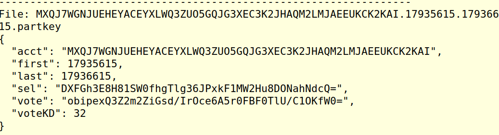

# Blockchain21: *Blockchain* #
### Academic year 2021/22 ###

## The Algorand Consensus protocol ##

The [slides](./consensus.pdf) give an overview of the PPoS consensus algorithm
at the basis of Algorand.

We next show how to take part in consensus

### Participating in Consensus: Step by step  ###

1. Generate participation keys

    It is too risky to have your spending key online to take part in consensus.
    Rather, you employ a participation key.


    ```goal account addpartkey -a <address> --roundFirstValid=<first-round> --roundLastValid=<last-round> ```

    This generates the participation key and gives it to the node

2. Check that the key exists in the node's database

    ```goal account listpartkeys```

3. Find out information about the participation keys

    ```goal account partkeyinfo```


    


4. Generate the key registration transaction

    ```$ goal account changeonlinestatus --address=<address> --fee=2000 --firstvalid=<first-round> --lastvalid=<last> --online=true --txfile=online.txn```


5. Take the ```online.txn``` to the offline machine with the spending key and sign the transaction

    ```algokey sign -m <mnemonic> -t online.txn -o registration.stxn```

6. Take the signed transaction to the online machine and send it to the node

    ```clerk rawsend --filename registration.stxn```


The whole process is executed by this [script](01-s.sh)
